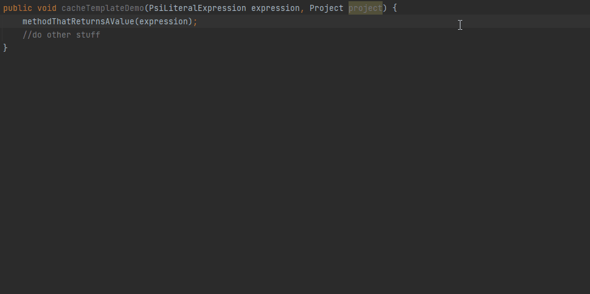

# Caching

## Surround with template for CachedValuesManager

  [](../src/main/resources/liveTemplates/DevKitPlus.xml)

This Live Template surrounds code snippets with a call to `CachedValuesManager.getCachedValue()`.
It is available in the common [Surround With action/menu](https://www.jetbrains.com/help/idea/surrounding-blocks-of-code-with-language-constructs.html).

There is no specific implementation for this. The template is created via the Live Template editor in Settings, then exported and added to the project.

Also, there can be cases (e.g. additional return statements) that are left untouched after this template is applied, thus those need extra care/cleanup.

The template is the following:
```java
com.intellij.psi.util.CachedValuesManager.getManager($PROJECT$).getCachedValue($PROJECT$, () -> {
    $SELECTION$
    return com.intellij.psi.util.CachedValueProvider.Result.create($RESULT$, $DEPENDENCY$);
});
$END$
```
where:
- `$PROJECT$` is configured to suggest variables of type `com.intellij.openapi.project.Project` if available,
- `$DEPENDENCY$` has a default value of `"com.intellij.openapi.util.ModificationTracker.NEVER_CHANGED"`



## CachedValueProvider.Result creation with no dependency

  [](../src/main/java/com/picimako/devkitplus/inspection/CachedValuesInspection.java)

During the creation of a `com.intellij.psi.util.CachedValueProvider.Result` object, if there is no dependency specified,
an error level message is logged saying:
> No dependencies provided which causes CachedValue to be never recalculated again. If this is intentional, please use ModificationTracker.NEVER_CHANGED

Considering this message, this inspection reports `Result` instance creations where there is no dependency specified, or the dependency is an empty collection.

In terms of empty collections, the following factory methods are considered during validation:
- `List.of()`
- `Set.of()`
- `Collections.emptyList()`
- `Collections.emptySet()`

There are some quick fixes available, either to add `ModificationTracker.NEVER_CHANGED` or `PsiModificationTracker.MODIFICATION_COUNT`
if there is no dependency, or replace empty collection dependency with one of them.


