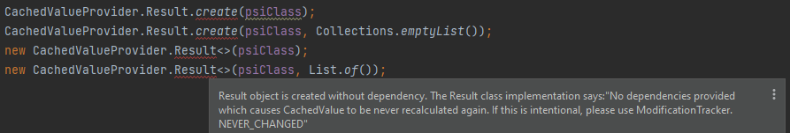

# Caching

## CachedValueProvider.Result creation with no dependency

  

During the creation of a `com.intellij.psi.util.CachedValueProvider.Result` object, if there is no dependency specified,
an error level message is logged saying:
> No dependencies provided which causes CachedValue to be never recalculated again. If this is intentional, please use ModificationTracker.NEVER_CHANGED

Considering this message, this inspection reports `Result` instance creations where there is no dependency specified, or the dependency is an empty collection.

In terms of empty collections, the following factory methods are considered during validation:
- `List.of()`
- `Set.of()`
- `Collections.emptyList()`
- `Collections.emptySet()`

There are some quick fixes available, either to add `ModificationTracker.NEVER_CHANGED` or `PsiModificationTracker.MODIFICATION_COUNT`
if there is no dependency, or replace empty collection dependency with one of them.

