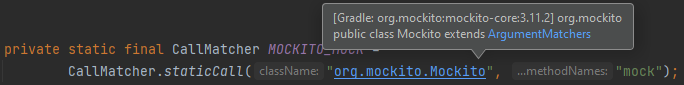
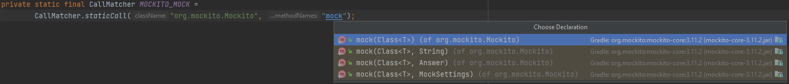
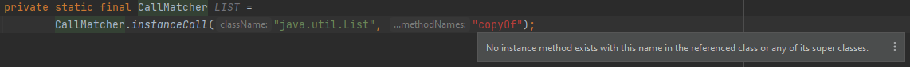
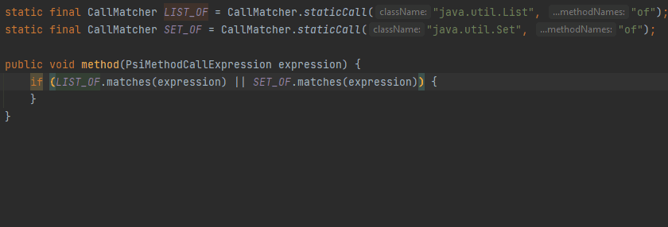

# CallMatcher

There is a smart tool called `CallMatcher` with which `PsiExpression`s can be matched against a class' fully qualified name, methods' name(s),
parameter count and types.

## References for CallMatcher static factory method arguments

  [](../src/main/java/com/picimako/justkitting/reference/CallMatcherReferenceContributor.java)

This reference contributor provides an alternative way to navigate to the classes and methods referenced in `CallMatcher`'s static factory methods.
The scope of search is everything in the current project plus libraries.

**Class**



**Method**

If the call is `CallMatcher.exactInstanceCall(...)`, then it provides references for methods exactly in the referenced class,
otherwise references are provided for methods in the super classes too.

If the call is `CallMatcher.staticCall(...)`, it provides references only for static methods.

Method references are added
- regardless of their parameter counts and types (for now at least),
- if the class name argument is an expression, and it can be evaluated



## No method with given name exists

  [](../src/main/java/com/picimako/justkitting/inspection/CallMatcherInspection.java)

This inspection reports method name arguments in calls to `com.siyeh.ig.callMatcher.CallMatcher`'s factory methods, if they don't exist in the current context of the CallMatcher.
A problem is registered only when the first argument (the class FQN) of the CallMatcher call can be identified,
so that false negatives are prevented.

If...
- the call is `CallMatcher#instanceCall(String, String...)`, problem is registered only when the method doesn't exist as an instance method in the class or any of its super classes.
- the call is `CallMatcher#exactInstanceCall(String, String...)`, problem is registered only when the method doesn't exist as an instance method in the class.
- the call is `CallMatcher#staticCall(String, String...)`, problem is registered only when the method doesn't exist as a static method in the class or any of its super classes.



## Combine CallMatcher boolean expressions to CallMatcher.anyOf()

  [](../src/main/java/com/picimako/justkitting/intention/callmatcher/CallMatchersConversionToAnyOfIntention.java)

`CallMatcher` provides an `anyOf()` factory method that would match if one of the provided matchers matches.

This intention combines `CallMatcher.<matches>` calls in selected boolean expressions with 2 or more operands into a single `CallMatcher.anyOf()` constant.

```java
//From:
if (LIST_OF.matches(expression) || MAP_OF.matches(expression) || SET_OF.matches(expression)) { }

//To:
private static final CallMatcher ANY_OF = CallMatcher.anyOf(LIST_OF, MAP_OF, SET_OF);
if (ANY_OF.matches(expression)) { }
```

All matcher methods of `CallMatcher` are recognized (matches, test, methodMatches, methodReferenceMatches, uCallMatches). Also, if the boolean expression is inside parenthesis,
it is still recognized and available for conversion.

In case the selected expression has multiple parent classes, it lets the user choose which one to introduce the constant in.


