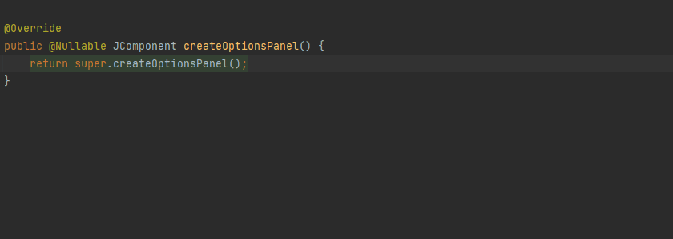
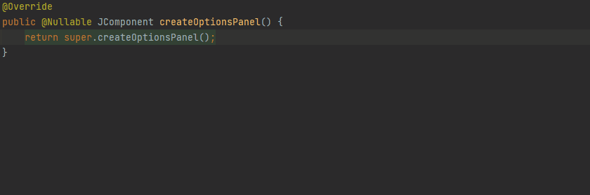

# Inspections

## Generate options panel

  [](../src/main/java/com/picimako/justkitting/action/inspectionpanel/CreateInspectionOptionsPanelAction.java)

There simple UI components in the `com.intellij.codeInspection.ui` package that are dedicated for use in `InspectionProfileEntry` implementations.

This action and the related sub-actions can generate the method body of the `createOptionsPanel()` method for some of these components.

**NOTE:**

For now, these actions replace the whole body of the `createOptionsPanel()` method, and don't just insert the code snippet. This is partly because of their usage
patterns throughout the intellij-community project.

### SingleCheckboxOptionsPanel

It replaces the method body with a simple new `SingleCheckboxOptionsPanel` instance creation. The label and field name parameter values are left empty.

<details>
      <summary><strong>Example...</strong></summary>

**From:**
  ```java
public class SomeInspection extends LocalInspectionTool {
    @Override
    public @Nullable JComponent createOptionsPanel() {
        return super.createOptionsPanel();
    }
}
  ```

**To:**
  ```java
public class SomeInspection extends LocalInspectionTool {
    @Override
    public @Nullable JComponent createOptionsPanel() {
        return new SingleCheckboxOptionsPanel("", this, "");
    }
}
  ```
</details>



### MultipleCheckboxOptionsPanel

`MultipleCheckboxOptionsPanel` is designed for panels with one or more checkboxes, thus the workflow here is a bit different.

Upon selecting this option from the list, you can also select the number of checkbox additions (the `addCheckbox()` calls) to generate.
For now, it is possible to choose from 1 to 5.

<details>
      <summary><strong>Example...</strong></summary>

**From:**
  ```java
public class SomeInspection extends LocalInspectionTool {
    @Override
    public @Nullable JComponent createOptionsPanel() {
        return super.createOptionsPanel();
    }
}
  ```

**To (given 3 checkboxes were selected):**
  ```java
public class SomeInspection extends LocalInspectionTool {
    @Override
    public @Nullable JComponent createOptionsPanel() {
        MultipleCheckboxOptionsPanel panel = new MultipleCheckboxOptionsPanel(this);
        panel.addCheckbox("", "");
        panel.addCheckbox("", "");
        panel.addCheckbox("", "");
        return panel;
    }
}
  ```
</details>



### SingleIntegerFieldOptionsPanel

Generating this essentially works the same way and with the same parameterization as `SingleCheckboxOptionsPanel`.

### ConventionOptionsPanel

Works the same as `SingleIntegerFieldOptionsPanel` or `SingleCheckboxOptionsPanel`, but it is generated with its own
proper parameter list.
