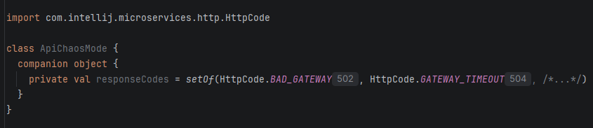

# Miscellaneous

## Expressions can be optimized

  [](../src/main/java/com/picimako/justkitting/inspection/OptimizeExpressionsInspection.java)

There are various convenience constants, methods, etc. with which one can optimize and/or simplify code.

This inspection groups them together and provides quick fixes when possible to replace code snippets to their more optimal form.

**EMPTY_ARRAY constants**

```java
//From:
PsiElement[] array = new PsiElement[0];
//To:
PsiElement[] array = PsiElement.EMPTY_ARRAY; //it is any type that has this EMPTY_ARRAY constant defined
```

**PsiExpressionList.getExpressions().length comparison**

```java
//From (the operands are recognized if they are switched too):
psiMethodCallExpression.getArgumentList().getExpressions().length == 0;
psiMethodCallExpression.getArgumentList().getExpressions().length > 0;
//To:
psiMethodCallExpression.getArgumentList().isEmpty();
!psiMethodCallExpression.getArgumentList().isEmpty();
```

## Enum field inlay hints

  [](../src/main/kotlin/com/picimako/justkitting/inlayhint/enums/EnumFieldInlayHintsProvider.kt)

This inlay hint is a small utility that displays the value of a specific field of an enum constant after each usage of that constant.

It can be useful in cases where the specified field value truly adds more context to the enum's usage, for instance,
showing the actual response code value for the `com.intellij.microservices.http.HttpCode` enum constants.



It is disabled by default because it supports only two enums at the moment and might be useful in specific circumstances.

NOTES:
* it doesn't support enums implemented in Java
* it requires the enum classes to be on the classpath to resolve
* the list enums and field names are not configurable yet
