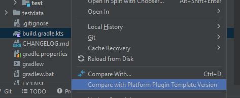
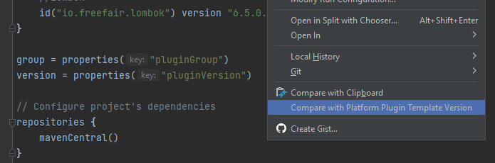
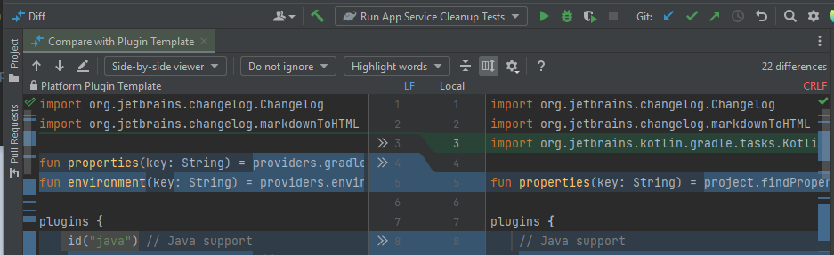
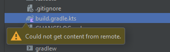
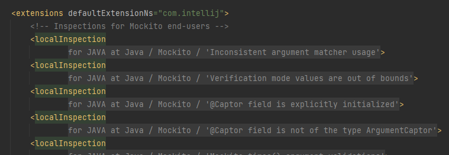
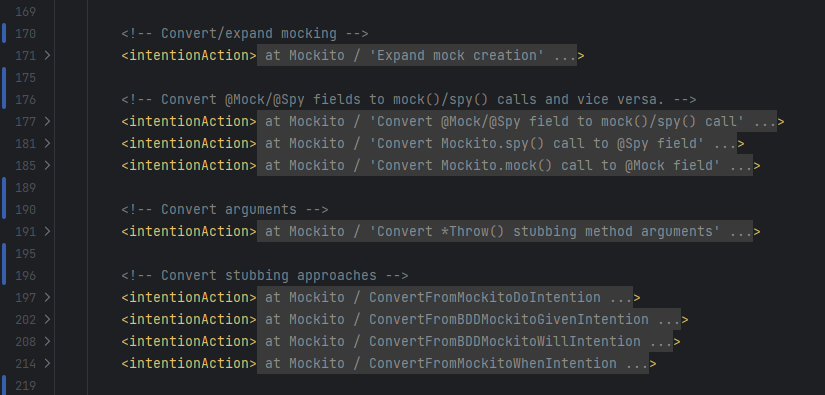

# Plugin Configuration

<!-- TOC -->
* [Configuration file diffs with the IntelliJ Platform Plugin Template](#configuration-file-diffs-with-the-intellij-platform-plugin-template)
* [XML tag folding in plugin descriptor files](#xml-tag-folding-in-plugin-descriptor-files)
  * [Supported tags](#supported-tags)
    * [extensions.localInspection / extensions.globalInspection](#extensionslocalinspection--extensionsglobalinspection)
    * [extensions.intentionAction](#extensionsintentionaction)
<!-- TOC -->

## Configuration file diffs with the IntelliJ Platform Plugin Template

  

This action is registered in editor and Project View context menus of certain plugin configuration files,
and it opens a two-sided diff view comparing the local version of the file with its IntelliJ Platform Plugin Template version on GitHub.

| Project view context menu                                                                                                    | Editor context menu                                                                                              |
|------------------------------------------------------------------------------------------------------------------------------|------------------------------------------------------------------------------------------------------------------|
|  |  |

The action is available for the following configuration files:
- `build.gradle.kts`
- `gradle.properties`
- `qodana.yml`
- `.github/dependabot.yml`
- `.github/workflows/build.yml`
- `.github/workflows/release.yml`
- `.github/workflows/run-ui-tests.yml`
- `gradle/libs.versions.toml`

The contents from GitHub are downloaded from the `main` branch of the template repository, directly from *https://raw.githubusercontent.com/JetBrains/intellij-platform-plugin-template/main/...*

If the remote contents cannot be downloaded, a balloon is displayed, and a log entry is logged with the reason of it.

## XML tag folding in plugin descriptor files

 

There are certain extensions, and XML tags in general, in `plugin.xml` and other plugin descriptor files that can hold a lot of information.
Having many such tags can make it more difficult for users to parse them, find the one they are looking for, or just scroll through them.

To improve these aspects, code folding is put in place to simplify the displayed information. They can be enabled/disabled
under <kbd>Settings</kbd> > <kbd>Editor</kbd> > <kbd>General</kbd> > <kbd>Code Folding</kbd> > <kbd>Just Kitting</kbd> section.

### Supported tags

#### extensions.localInspection / extensions.globalInspection

 

The `<localInspection>` and `<globalInspection>` tags within `<extensions defaultExtensionNs="com.intellij">` fold in the form of **'for [language] at [path]'**,
and support the following attributes for folding:

| Attribute      | Attribute value example  | Placeholder text                         |
|----------------|--------------------------|------------------------------------------|
| `language`     | JAVA                     | *for JAVA*                               |
| `groupPath`    | Group Group,Path     | *Group* *Group / Path*               |
| `groupPathKey` | group.path.key           | *{group.path.key}* (when not resolved)   |
| `groupName`    | Group Name               | *Group Name*                             |
| `groupKey`     | group.name.key           | *{group.name.key}* (when not resolved)   |
| `displayName`  | Looks for invalid things | *'Looks for invalid things'*             |
| `key`          | display.name.key         | *{display.name.key}* (when not resolved) |

Resource bundle keys are resolved according to their resolution fallback chain:
- `key`: `bundle` attribute -> `<resource-bundle>` tag
- `groupPathKey`: `groupBundle` attribute -> `bundle` attribute -> `<resource-bundle>` tag
- `groupKey`: `groupBundle` attribute ->  `bundle` attribute -> `<resource-bundle>` tag

**Notes:**
- group path comma delimiters are replaced with forward-slashes for better visuals
- the placeholder text for keys show the keys themselves enclosed in `{` and `}`.

**Example:**

#### extensions.intentionAction

 

The `<intentionAction>` tags within `<extensions defaultExtensionNs="com.intellij">` fold in the form of
** for [language] at [category] / [family name or class name] ...**.

The `<intentionAction>` tags are folded regardless of what subtags of them are present and in what order.

If the language is not configured (e.g. not available in earlier platform versions) the tag folds without the language as
** at [category] / [family name or class name] ...**

**Class names:**

The `<className>` tag is resolved to the short name of the class, or if the plugin, whose project is currently open,
is also installed in the IDE, thus it has the intention action classes registered, it evaluates their `getFamilyName()`
methods to provide a better placeholder text.

For now, the plugin cannot evaluate the family name of `IntentionAction` classes in the currently open project.

**Example:**

