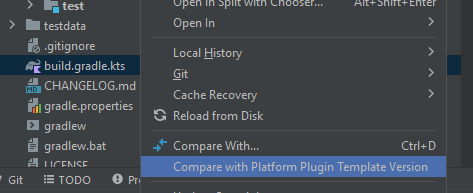
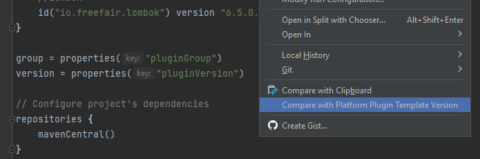
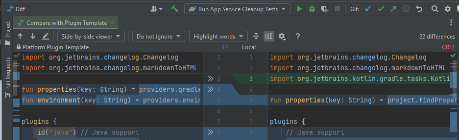
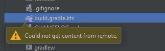
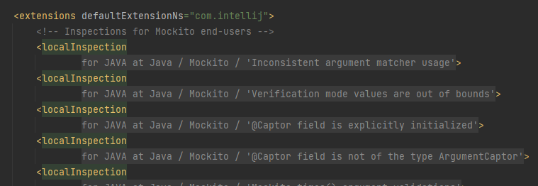
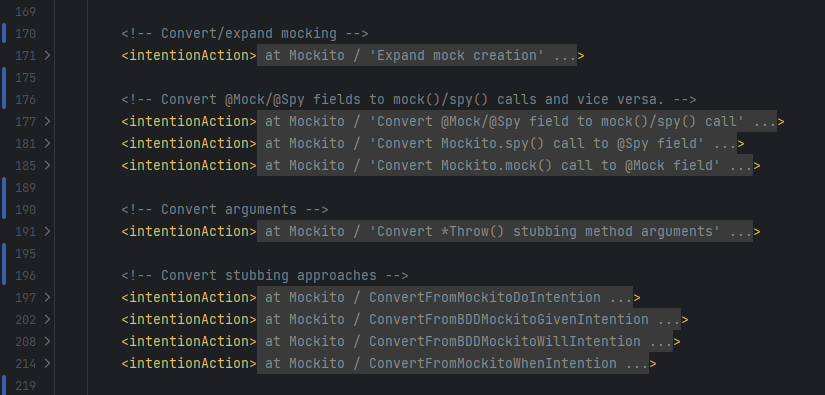
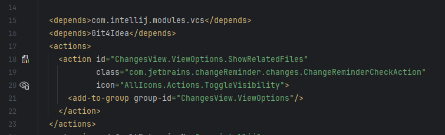
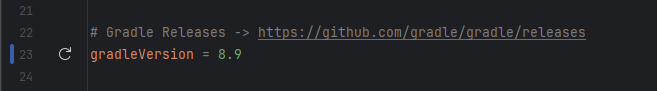
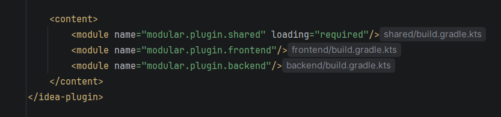

# Plugin Configuration

<!-- TOC -->
* [Configuration file diffs with the IntelliJ Platform Plugin Template](#configuration-file-diffs-with-the-intellij-platform-plugin-template)
* [XML tag folding in plugin descriptor files](#xml-tag-folding-in-plugin-descriptor-files)
  * [Supported tags](#supported-tags)
    * [extensions.localInspection / extensions.globalInspection](#extensionslocalinspection--extensionsglobalinspection)
    * [extensions.intentionAction](#extensionsintentionaction)
* [Extension/Action icon line markers](#extensionaction-icon-line-markers)
* [Line marker for updating the Gradle Wrapper version](#line-marker-for-updating-the-gradle-wrapper-version)
* [Inlay hints to navigate to module build files from plugin.xml](#inlay-hints-to-navigate-to-module-build-files-from-pluginxml)
<!-- TOC -->

## Configuration file diffs with the IntelliJ Platform Plugin Template

  [](../src/main/java/com/picimako/justkitting/action/diff/CompareConfigFileWithPluginTemplateAction.java)

This action is registered in editor and Project View context menus of certain plugin configuration files,
and it opens a two-sided diff view comparing the local version of the file with its IntelliJ Platform Plugin Template version on GitHub.

| Project view context menu                                                                                                    | Editor context menu                                                                                              |
|------------------------------------------------------------------------------------------------------------------------------|------------------------------------------------------------------------------------------------------------------|
|  |  |

The action is available for the following configuration files:
- `build.gradle.kts`
- `gradle.properties`
- `qodana.yml`
- `.github/dependabot.yml`
- `.github/workflows/build.yml`
- `.github/workflows/release.yml`
- `.github/workflows/run-ui-tests.yml`
- `gradle/libs.versions.toml`

The contents from GitHub are downloaded from the `main` branch of the template repository, directly from *https://raw.githubusercontent.com/JetBrains/intellij-platform-plugin-template/main/...*



If the remote contents cannot be downloaded, a balloon is displayed, and a log entry is logged with the reason of it.



## XML tag folding in plugin descriptor files

 [](../src/main/java/com/picimako/justkitting/codefolding/plugindescriptor/PluginDescriptorTagsFoldingBuilder.java)

There are certain extensions, and XML tags in general, in `plugin.xml` and other plugin descriptor files that can hold a lot of information.
Having many such tags can make it more difficult for users to parse them, find the one they are looking for, or just scroll through them.

To improve these aspects, code folding is put in place to simplify the displayed information. They can be enabled/disabled
under <kbd>Settings</kbd> > <kbd>Editor</kbd> > <kbd>General</kbd> > <kbd>Code Folding</kbd> > <kbd>Just Kitting</kbd> section.

### Supported tags

#### extensions.localInspection / extensions.globalInspection

 [](../src/main/java/com/picimako/justkitting/codefolding/plugindescriptor/InspectionFolder.java)

The `<localInspection>` and `<globalInspection>` tags within `<extensions defaultExtensionNs="com.intellij">` fold in the form of **'for [language] at [path]'**,
and support the following attributes for folding:

| Attribute      | Attribute value example  | Placeholder text                         |
|----------------|--------------------------|------------------------------------------|
| `language`     | JAVA                     | *for JAVA*                               |
| `groupPath`    | Group<br/>Group,Path     | *Group*<br/>*Group / Path*               |
| `groupPathKey` | group.path.key           | *{group.path.key}* (when not resolved)   |
| `groupName`    | Group Name               | *Group Name*                             |
| `groupKey`     | group.name.key           | *{group.name.key}* (when not resolved)   |
| `displayName`  | Looks for invalid things | *'Looks for invalid things'*             |
| `key`          | display.name.key         | *{display.name.key}* (when not resolved) |

Resource bundle keys are resolved according to their resolution fallback chain:
- `key`: `bundle` attribute -> `<resource-bundle>` tag
- `groupPathKey`: `groupBundle` attribute -> `bundle` attribute -> `<resource-bundle>` tag
- `groupKey`: `groupBundle` attribute ->  `bundle` attribute -> `<resource-bundle>` tag

**Notes:**
- group path comma delimiters are replaced with forward-slashes for better visuals
- the placeholder text for keys show the keys themselves enclosed in `{` and `}`.

**Example:**



#### extensions.intentionAction

 [](../src/main/java/com/picimako/justkitting/codefolding/plugindescriptor/IntentionActionFolder.java)

The `<intentionAction>` tags within `<extensions defaultExtensionNs="com.intellij">` fold in the form of
**for [language] at [category] / [family name or class name] ...**.

The `<intentionAction>` tags are folded regardless of what subtags of them are present and in what order.

If the language is not configured (e.g. not available in earlier platform versions) the tag folds without the language as
**at [category] / [family name or class name] ...**

**Class names:**

The `<className>` tag is resolved to the short name of the class, or if the plugin, whose project is currently open,
is also installed in the IDE, thus it has the intention action classes registered, it evaluates their `getFamilyName()`
methods to provide a better placeholder text.

For now, the plugin cannot evaluate the family name of `IntentionAction` classes in the currently open project.

**Example:**



## Extension/Action icon line markers

  [](../src/main/java/com/picimako/justkitting/linemarker/AnActionIconLineMarkerProvider.java)

To improve the comprehension of extension and action registrations in plugin descriptor files, the following two tag attributes
are extended with a line marker to show the referenced icons:
- `idea-plugin.actions.action@icon`
- `idea-plugin.actions.group.action@icon` at any level of nesting of `<group>` tags
- `idea-plugin.extensions.toolWindow@icon`

Currently supported locations:
- icons in `com.intellij.icons.AllIcons`
- classes residing in the top-level `icons` package,
- fully qualified names to a certain extent

It works on plugin/modules descriptor files in plugins and the intellij-community project.
Icons specified by a relative path within the current project are not supported.

The line marker is enabled by default and can be disabled under `Settings > Editor > General > Gutter Icons > Just Kitting >
Extension and action icons in IDE plugin descriptor files`.



## Line marker for updating the Gradle Wrapper version

  [](../src/main/java/com/picimako/justkitting/linemarker/UpdateGradleVersionLineMarkerProvider.java)

For plugin projects built on the [intellij-platform-plugin-template](https://github.com/JetBrains/intellij-platform-plugin-template)
this line marker can be useful to easily update the Gradle wrapper.

It is displayed on the `gradleVersion` property in `gradle.properties` when the version specified there differs from the one
in the `distributionUrl` property of `/gradle/wrapper/gradle-wrapper.properties`.



Upon clicking the line marker, it creates a new Gradle run configuration (or reuses the existing one) with the following command, and executes it:

```
wrapper --gradle-version=<value of gradleVersion> --distribution-type=<type, i.e. bin or all, from distributionUrl>
```

## Inlay hints to navigate to module build files from plugin.xml

  [](../src/main/kotlin/com/picimako/justkitting/inlayhint/buildfile/ModuleBuildFileInlayHintsProvider.kt)

The `plugin.xml` file in multi-module (i.e. split-mode) projects defines content modules like this
(using the [intellij-platform-modular-plugin-template](https://github.com/JetBrains/intellij-platform-modular-plugin-template) as the example):

```xml
<idea-plugin>
    <content>
      <module name="modular.plugin.shared" loading="required"/>
      <module name="modular.plugin.frontend"/>
      <module name="modular.plugin.backend"/>
    </content>
</idea-plugin>
```

The `name` attribute of each `<module>` tag resolves to the corresponding module's module descriptor files,
e.g. for the example above `PROJECT_ROOT/frontend/src/main/resources/modular.plugin.frontend.xml` for the frontend module.

If one wants to navigate to the build file (`build.gradle.kts`, `BUILD.bazel`) of a module from the `plugin.xml`, there is
no direct and quick way, but e.g. navigating through Search Everywhere, the Project View, etc.

In order to make this navigation easier, an inlay hint is added after each `<module>` tag that, upon Ctrl/Cmd + clicking on it,
resolves the module's build file and opens it on a new editor tab or focuses on it if it is already open.



NOTE: the inlay hints provider uses a naive approach for finding the build file, so it may not be able to find it
in all cases.