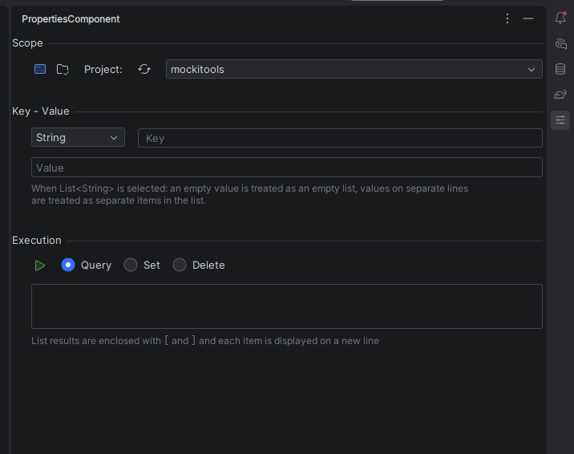

# PropertiesComponent Tool Window

This is a dedicated tool window in which you can query, set and delete values in the project- and application-level `PropertiesComponent`s.

## Scope

You can switch between application and project level, and when targeting the latter, the target project can be selected from the Projects dropdown.

The list of projects is not updated automatically when a project is opened, closed, etc. but you can reload them with the
 button.

## Key - Value

Keys can be set and queried as `String`s or as `List<String>`s as per `PropertiesComponent`’s inner workings. When specifying their values, consider the following:
- Keys must be non-empty
- Values can be empty and multi-line
- When `List<String>` is selected, values on each line are treated as separate list items.

## Execution

The bottom section is where you can select what operation to execute
Set: sets Value for Key as the selected value type
Query: fetches the value of Key as the selected value type
Delete: deletes the value for Key based on the selected value type

It is also here that the execution result is displayed with the following additions:
- Successful Set and Delete operations don’t display any result
- Lists
    - List results are displayed as items in separate lines, enclosed by `[` and `]`.
- Errors
    - `null` values are displayed as `<null>`
    - Empty list values are displayed as `<empty list>`
    - Error messages are displayed as `<some error message>`

Execution can be performed by clicking on the
 button or alternatively hitting Enter in the Key field.

## Reloading of tool window fields

The following choices and values are stored on the project level so that you can resume work easily in the tool window
after reopening the project or restarting the IDE:
- level: application or project
- value type, key, value
- operation: Set, Query, Delete
